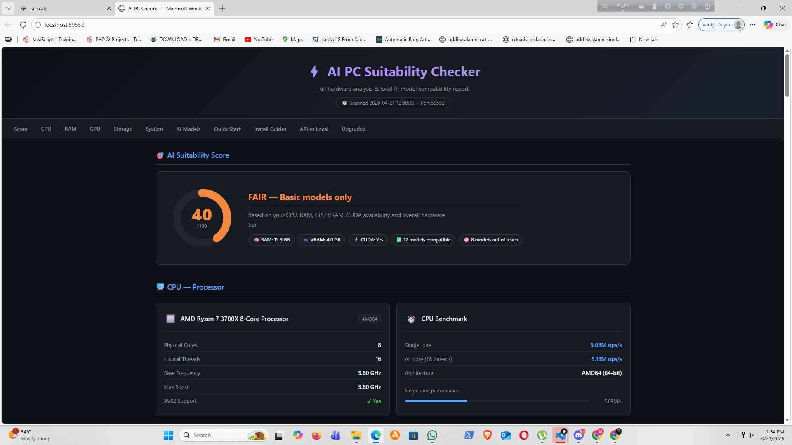

# 🤖 AI PC Suitability Checker

> Instantly discover whether your PC is ready for **local AI** — and how it compares to cloud APIs.



---

## ✨ Features

| Feature | Details |
|---|---|
| **Hardware Scanner** | CPU, RAM (speed + type), GPU (VRAM + tier), Disk, OS |
| **AI Suitability Score** | 0–100 score with S+ → F tier rating |
| **Model Compatibility** | 25+ AI models — Text, Code, Vision, Image Gen, Speech, Embeddings |
| **Install Commands** | One-click copy for Ollama / LM Studio per model |
| **API vs Local** | Speed (tok/s), Latency, Cost/month, Feature matrix vs 14 cloud providers |
| **Web Dashboard** | Dark-themed browser UI, auto-opens on a free port |
| **CLI Version** | Rich terminal output, saves `ai_pc_report.json` |
| **Cross-platform** | Windows, Linux, macOS (web + CLI) |

---

## 📸 Screenshot


---

## 🚀 Quick Start

### Option A — Bash (Linux / macOS / WSL / Git Bash)

```bash
git clone https://github.com/uddin-salamd/ai-pc-checker.git
cd ai-pc-checker
chmod +x install.sh start.sh
./install.sh          # sets up venv + installs dependencies
./start.sh            # opens web dashboard in browser
```

### Option B — Windows (PowerShell / CMD)

```bat
git clone https://github.com/uddin-salamd/ai-pc-checker.git
cd "ai-pc-checker"
pip install -r requirements.txt
python ai_pc_web.py
```

Or just double-click **`run_checker.bat`**.

### Option C — CLI only (no browser)

```bash
./start.sh --cli           # bash
python ai_pc_checker.py    # any OS
```

---

## 🛠️ Scripts

| Script | Purpose |
|---|---|
| `install.sh` | Creates `.venv`, installs all packages, verifies CUDA |
| `start.sh` | Activates venv, launches web server (or `--cli` flag for terminal mode) |
| `run_checker.bat` | Windows double-click launcher for web dashboard |
| `ai_pc_web.py` | Main Flask web application |
| `ai_pc_checker.py` | Standalone CLI version (Rich terminal UI) |

---

## 📦 Requirements

```
psutil>=5.9.0       # CPU, RAM, Disk info
rich>=13.0.0        # Terminal UI (CLI version)
gputil>=1.4.0       # NVIDIA GPU info via nvidia-smi
py-cpuinfo>=9.0.0   # Detailed CPU info (AVX2, flags)
flask>=3.0.0        # Web dashboard
```

All packages are **auto-installed** on first run if missing. Python **3.9+** required.

---

## 🖥️ Hardware Detection

- **CPU**: Name, cores (physical/logical), frequency, benchmark score, AVX2 support
- **RAM**: Total, used, speed (MHz), type (DDR3/4/5) via WMI
- **GPU**: VRAM, driver, CUDA version — NVIDIA via `nvidia-smi`, AMD/Intel via WMI
- **Disk**: Total/free space, read/write speed, SSD vs HDD detection
- **OS**: Windows build, Linux distro, macOS version

---

## 🤖 Supported AI Models

### Text / Chat
`Llama 3.1 8B` · `Llama 3.1 70B` · `Mistral 7B` · `Phi-3 Mini` · `Gemma 2 2B` · `Qwen 2.5 7B`

### Code
`CodeLlama 7B` · `CodeLlama 34B` · `DeepSeek Coder 6.7B` · `Starcoder2 3B`

### Vision
`LLaVA 7B` · `LLaVA 13B` · `BakLLaVA`

### Image Generation
`Stable Diffusion 1.5` · `Stable Diffusion XL` · `Stable Diffusion 3`

### Speech
`Whisper Base` · `Whisper Large v3` · `Bark TTS`

### Embeddings
`nomic-embed-text` · `all-minilm` · `mxbai-embed-large`

---

## ☁️ API vs Local Comparison

Compares your hardware against **14 cloud AI providers**:

`OpenAI` · `Anthropic` · `Google Gemini` · `Groq` · `Together AI` · `Mistral` · `Cohere` · `Perplexity` · `Fireworks` · `DeepInfra` · `Anyscale` · `Replicate` · `Hugging Face` · `AWS Bedrock`

**Metrics compared:**
- ✅ Inference speed (tokens/sec)
- ✅ First-token latency (ms)
- ✅ Cost per 1M tokens (input + output)
- ✅ Estimated monthly electricity cost
- ✅ Break-even point (when local becomes cheaper)
- ✅ Feature matrix (offline, privacy, customisation, no rate limits)

---

## 📊 AI Suitability Score

| Score | Tier | Meaning |
|---|---|---|
| 85–100 | **S+** | Flagship AI workstation — runs everything |
| 70–84 | **S** | Excellent — handles most large models |
| 55–69 | **A** | Great — runs 13B+ models smoothly |
| 40–54 | **B** | Good — best with 7B models |
| 25–39 | **C** | Fair — 3B models, CPU inference |
| 10–24 | **D** | Limited — small/quantised models only |
| 0–9 | **F** | Not recommended for local AI |

---

## 🔧 Troubleshooting

**GPU not detected?**
- Install NVIDIA drivers: https://www.nvidia.com/drivers
- For AMD/Intel, WMI fallback is used automatically on Windows

**Flask port already in use?**
The app auto-selects a free port on every run — this should never happen.

**Import errors?**
```bash
pip install -r requirements.txt --force-reinstall
```

**nvidia-smi not found?**
Install NVIDIA CUDA Toolkit: https://developer.nvidia.com/cuda-downloads

---

## 📁 Project Structure

```
ai-pc-checker/
├── ai_pc_web.py        # Flask web dashboard (main app)
├── ai_pc_checker.py    # CLI version (Rich terminal UI)
├── requirements.txt    # Python dependencies
├── install.sh          # Linux/macOS/WSL install script
├── start.sh            # Linux/macOS/WSL start script
├── run_checker.bat     # Windows launcher
├── screenshot.png      # Dashboard screenshot
└── README.md           # This file
```

---

## 📄 License

MIT License — free to use, modify, and distribute.

---

## 🤝 Contributing

1. Fork the repo
2. Create a feature branch: `git checkout -b feature/my-feature`
3. Commit your changes: `git commit -m 'Add my feature'`
4. Push: `git push origin feature/my-feature`
5. Open a Pull Request

---

## ⭐ Star this repo if it helped you choose the right AI setup!
